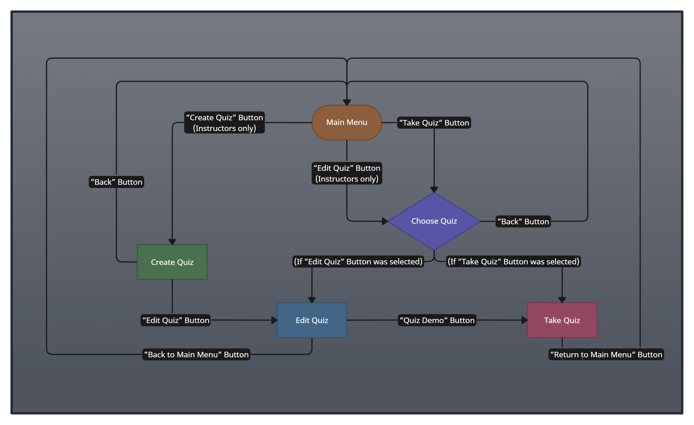
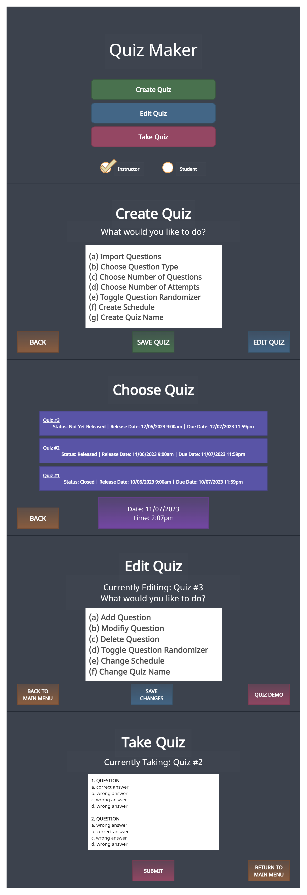
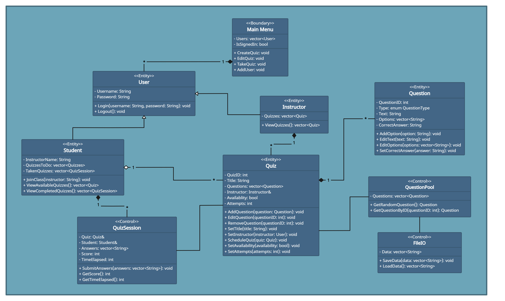
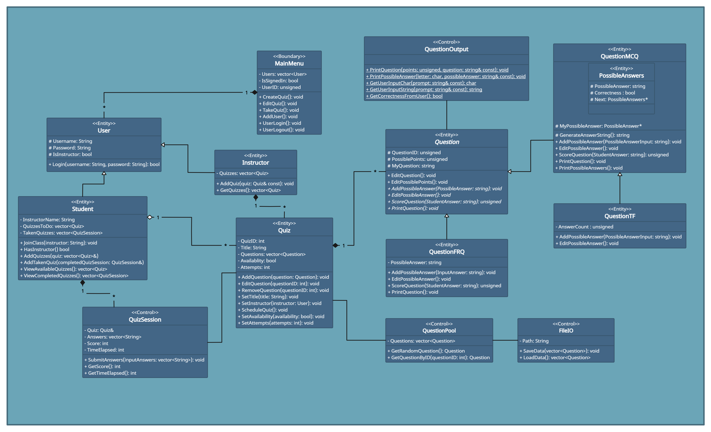

# Quiz Maker
 
 > Authors: [Nelson Tran](https://github.com/Grymrose), [Yijun Shang](https://github.com/TobyShang), [Chengkun Liao](https://github.com/Caboose-Chengkun-Liao), [Daniel Zhang](https://github.com/Kal4shn1k0v), [Yunfan Li](https://github.com/UCRCSYunfanLi)

## Project Description
The "**Quiz Maker**" project is important and interesting to us because it addresses the needs of both instructors and students. In the digital age, creating and managing quizzes efficiently is crucial for educators, and providing students with a user-friendly platform to take quizzes can enhance their learning experience. This project aligns technology with education, making it convenient for both teachers and learners, which we find compelling.

We plan to implement the "**Quiz Maker**" application in **C++**. In addition, we will use **Git** and **GitHub** for version control and collaborative development, and also utilize **scrum** methodology for efficient project management.

For the **input of our project**, instructors can upload text files representing question pools. These files contain different types of questions (e.g. multiple-choice, true/false, free response) and correct answers. The uploaded files can also specify the required question types and the number of questions for creating quizzes.

For the **output of our project**, the application will generate quizzes based on the uploaded question pools. Instructors can customize the quizzes, including setting the number and types of questions. Students can access and take quizzes through the user interface.

The "**Quiz Maker**" project will provide a range of **features** for instructors and students:
* **Question Pool Upload**: Instructors can upload text files representing question pools in various formats, including plain text and JSON.
* **Question Type Variety**: The system supports different question types, such as multiple-choice, true/false, and free response.
* **Quiz Generation**: Instructors can automatically create quizzes by specifying the desired question types and the number of questions.
* **Customization**: Instructors can edit and customize quizzes, including setting the number of questions and specific types.
* **Sub-Questions**: Quizzes can contain questions consisting of sub-questions of different types.
* **Student Access**: Students can access quizzes through a user-friendly web-based interface.
* **Multiple Attempts**: Instructors can allow students to take quizzes once or multiple times, providing flexibility in assessment.
* **Quiz Scheduling**: Instructors can schedule quizzes to be available at specific dates and times, allowing for better time management in educational settings.
* **Randomized Questions**: Provide an option for instructors to randomize the order of questions in quizzes, reducing the potential for cheating during online assessments.
* **Export and Import Quizzes**: Allow instructors to export and import quizzes, enabling them to share quizzes with their colleagues or use them in different courses without the need to recreate them.

## User Interface Specification
### Navigation Diagram

The user navigation diagram above illustrates how users can move between different screens within the "Quiz Maker" application. The diagram includes the following screens:
* **Main Menu**: The starting point for both instructors and students. Instructors can create, edit, and test quizzes, while students can access and take quizzes.
* **Create Quiz**: Instructors can create new quizzes, schedule quizzes, import quizzes, and enable randomization for added security. From here, the user will be brought to a different screen for editing the quiz.
* **Choose Quiz**: Instructors can choose what quiz they would to either edit or test depending on what choice they main in the main menu. Students can choose what quiz to take, as long as it's made available.
* **Edit Quiz**: Instructors can edit existing quizzes, or the one they just made. From here, the user is able to add, modify, or delete questions within a quiz. In addition, they can change when the quiz should be made available.
* **Take Quiz**: Instructors can test out quizzes they have made and Students can take a quiz that they selected based on what was made available.

### Screen Layouts

**General Layout**
* **Header**: Displays the name of the screen the user is on.
* **Main Content Area**: Displays screen-specific content, such as quiz details, list of quizzes, quiz-taking interface etc.
* **Navigation Footer**: Displays button(s) that take the user to another screen.
 
**"Main Menu" Screen**
* **Header**: Follows the standard format by displaying the name of the screen the user is on, which is "Main Menu".
* **Main Content Area**: Lists three options for instructors. Students can only take quizzes. The "Create Quiz" button will bring the user directly to the "Create Quiz" screen, whereas the other two buttons will instead send the user to the Choose Quiz" screen, as the "Edit Quiz" and "Take Quiz" screens need to have a quiz selected to function.
* **Footer**: Unlike the other screens, the navigation buttons are in the middle in the main menu. There will be a prompt for the user to sign in as an instructor or a student. They are signed in when one of the two circles at the footer are marked.
 
**"Create Quiz" Screen**
* **Header**: Follows the standard format by displaying the name of the screen the user is on, which is "Create Quiz".
* **Main Content Area**: Prompts the user to choose an option. Each option will build a part of the new quiz.
* **Navigation Footer**: Displays three buttons. The "Back" button takes the user back to the main menu. The "Save Quiz" button saves the quiz. The "Edit Quiz" button that take the user to the "Edit Quiz" screen to finish editing the new quiz.
 
**"Choose Quiz" Screen**
* **Header**: Follows the standard format by displaying the name of the screen the user is on, which is "Choose Quiz".
* **Main Content Area**: Displays all quizzes for instructors. Displays all available quizzes for students. The screen diagram shows an example of this for instructors where three quizzes are displayed, each with a different status of being closed, released, and not yet released.
* **Navigation Footer**: Displays the "Back" button, which takes the user back to the main menu. Also showcases the current date and time.
 
**"Edit Quiz" Screen**
* **Header**: Follows the standard format by displaying the name of the screen the user is on, which is "Edit Quiz". Also displays what quiz is being edited (the screen diagram for this shows an example of this where "Quiz #3" is the one being edited).
* **Main Content Area**: Prompts the user to choose an option. Each option will adjust a part of the selected quiz.
* **Navigation Footer**: Displays three buttons. The "Back to Main Menu" button takes the user back to the main menu. The "Save Changes" button saves the new changes to the quiz. The "Quiz Demo" button that take the user to the "Take Quiz" screen to test out the quiz.
 
**"Take Quiz" Screen**
* **Header**: Follows the standard format by displaying the name of the screen the user is on, which is "Take Quiz". Also displays the quiz being taken (the screen diagram for this shows an example of this where "Quiz #2" is the one being taken).
* **Main Content Area**: Displays the quiz questions. Answer choices will also display under questions if appropriate.
* **Navigation Footer**: Displays two buttons. The "Submit" button submits the quiz. The "Return to Main Menu" button sends the user to the main menu (only clickable after the quiz has been submitted).

## Class Diagram

This class diagram represents the structure and relationships of the classes in the "Quiz Maker" application. The classes are categorized into three main types: Boundary, Entity, and Control classes, denoted by labels.

**Boundary Class**
* **MainMenu**: Represents the class that calls the others. This will be where most of the user interaction will be connect to. Has one attribute of a vector that holds objects of the User class and another to determine if someone is signed in or not (total of two attributes). It also provides three methods for creating, editing, & taking quizzes, and an additional method for adding new users into the program (total of four methods in this class).

**Entity Classes**
* **User**: This class represents a user for this program. It holds two String attributes for a username and a password. There are two methods for signing in and for signing out. Shares composition relationship with the MainMenu class.
* **Instructor**: Derived class of User. Has one attribute of a vector that holds Quiz objects and has one method for viewing the vector of Quiz objects associated with the Instructor.
* **Student**: Derived class of User. Has one attribute of a String that determines who the instructor is, and two attributes of vectors, one holding Quiz objects and one holding QuizSession objects (total of three attributes). Has three methods that lets a Student User join a class based off of an Instructor's username, view all available quizzes to be taken, and view all quizzes completed. 
* **Quiz**: This class represents a quiz. There are six attributes for the quiz's ID integer, a String for the title, a vector of Question objects, a reference to the associated instructor, a boolean for the quiz's availability, and an integer for the number of attempts allowed. In addition, there are eight methods for adding a question, editing a question, removing a question, setting a title for the quiz, setting the instructor associated with the quiz, scheduling the quiz, setting the quiz's availability, and setting the number of attempts. This class is associated with the QuizSession class, shares an aggregation relationship with the Student class, and shares a composition relationship with the Instructor class.
* **Question**: This class represents a question in a quiz. It has three attributes with a question's ID unsigned number, an unsigned number of possible points, and a String of the text prompted. There are six methods for editing the question String, editing the unsigned number of possible points, an abstract pure virtual function that adds a possible answer String, an abstract pure virtual function that edits a possible answer, an abstract pure virtual function that scores the question, and an abstract pure virtual function that prints the question. Shares a composition relationship with the Quiz class.
* **QuestionMCQ**: Derived class of Question. This class represents a multiple choice question in a quiz. It has one attribute that points to the first possible answer of the question. There are six methods for generating an answer String (this is protected, the other methods are all public), adding a possible answer, editing a possible answer, scoring the question, printing the question prompt, and printing the answers of the question.
  * It has a nested struct called "**PossibleAnswers**". This struct has four attributes with a String that holds a possible answer, a boolean that determines if an answer is correct or not, and a pointer that points to the next answer in the linked list of PossibleAnswers as long as it's not pointed to nothing.
* **QuestionTF**: Derived class of QuestionMCQ. This class represents a true/false question in a quiz. It has one attribute that holds an unsigned number of answers. There are two methods that can add a possible answer (should not surpass two total answers) and can edit a possible answer. 
* **QuestionFRQ**: Derived class of Question. This class represents a free-response question in a quiz. It has one attribute that holds a String of a possible answer. There are four methods that can add one possible answer, edit the possible answer, score the question, and printing the question.

**Control Classes**
* **QuizSession**: This class is for a quiz session. There's five attributes: a reference to a Quiz object, a reference to a Student object, a vector of Strings for answers, and two integers for a score and time elapsed. It has three methods to submit answers, get the score, and the time elapsed. Shares a composition relationship with the Student class, and shares an assocation with the Quiz class.
* **QuestionPool**: This class manages a pool of questions, with an attribute for available questions. It provides methods to retrieve random questions and specific questions by ID. Associates with the Quiz and FileIO classes.
* **FileIO**: Handles file input/output operations with an attribute of a String vector. Its methods can save and load data, enabling data persistence. Associates with the QuestionPool class.

## New Class Diagram (with S.O.L.I.D. Principles)

#### Our old diagram had already followed some SOLID Principles
* One SOLID Principle followed was the **Open-Closed Principle**.
  * We applied this principle by ensuring that new subclasses could be added to the **User** and **Question** classes without needing to edit existing functions.
  * This helps us write better code by allowing more freedom to add more potential customization to our program in the future if needed.
* Another SOLID Principle followed was the **Liskov’s Substitution Principle**.
  * We applied this principle by ensuring that our **Question** class's subclasses and the **User** class's subclasses are able to behave the same as their respective superclass.
  * This helps us write better code by keeping our code clean to minimize bugs. Also helps our program's logic to be clear to both us, the programmers, and to the users.
* Another SOLID Principle followed was the **Interface Segregation Principle**.
  * We applied this principle by ensuring that our Question and User classes did not have any abstract functions forced onto their respective subclasses that couldn't apply said functions.
  * This helps us write better code by allowing us to create subclasses of various types without worrying of implementing unnecessary functions due to forced pure abstract functions from their superclass.
#### **CHANGE**: Added a new Control Class called "**QuestionOutput**".
* The SOLID Principle applied with this change is the **Single Responsibility Principle**.
  * We applied this principle by ensuring that our **Question** class and all of its subclasses only has functions relating to a question in a quiz. All printing capabilities are now a part of the **QuestionOutput** class.
  * This change helps us write better code by allowing us to not worry about messing up printing functionalities when changing any code of the Question class and its subclasses.
* The **QuestionOutput** class is for all printing purposes related to the Question class and its subclasses. There are five methods that can print a question, print a question's possible answers if appropriate, it get prompt the user for a character, it can prompt the user for a String, and can prompt the user to set a boolean. 
