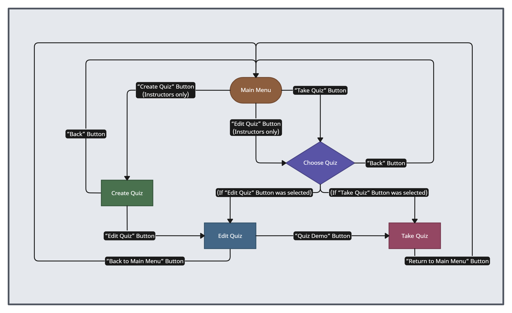
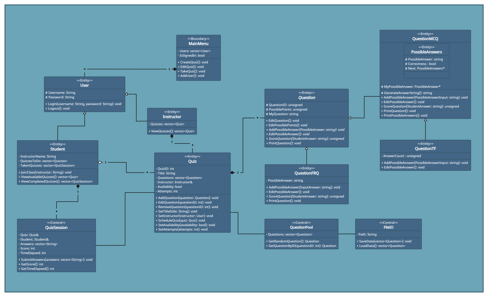

# Quiz Maker
 
 > Authors: [Nelson Tran](https://github.com/Grymrose), [Yijun Shang](https://github.com/TobyShang), [Chengkun Liao](https://github.com/Caboose-Chengkun-Liao), [Daniel Zhang](https://github.com/Kal4shn1k0v), [Yunfan Li](https://github.com/UCRCSYunfanLi)

## Project Description
The "**Quiz Maker**" project is important and interesting to us because it addresses the needs of both instructors and students. In the digital age, creating and managing quizzes efficiently is crucial for educators, and providing students with a user-friendly platform to take quizzes can enhance their learning experience. This project aligns technology with education, making it convenient for both teachers and learners, which we find compelling.

We plan to implement the "**Quiz Maker**" application in **C++**. In addition, we will use **Git** and **GitHub** for version control and collaborative development, and also utilize **scrum** methodology for efficient project management.

For the **input of our project**, instructors can upload text files representing question pools. These files contain different types of questions (e.g. multiple-choice, true/false, free response) and correct answers. The uploaded files can also specify the required question types and the number of questions for creating quizzes.

For the **output of our project**, the application will generate quizzes based on the uploaded question pools. Instructors can customize the quizzes, including setting the number and types of questions. Students can access and take quizzes through the user interface.

The "**Quiz Maker**" project will provide a range of **features** for instructors and students:
* **Question Pool Upload**: Instructors can upload text files representing question pools in various formats, including plain text and JSON.
* **Question Type Variety**: The system supports different question types, such as multiple-choice, true/false, and free response.
* **Quiz Generation**: Instructors can automatically create quizzes by specifying the desired question types and the number of questions.
* **Customization**: Instructors can edit and customize quizzes, including setting the number of questions and specific types.
* **Sub-Questions**: Quizzes can contain questions consisting of sub-questions of different types.
* **Student Access**: Students can access quizzes through a user-friendly web-based interface.
* **Multiple Attempts**: Instructors can allow students to take quizzes once or multiple times, providing flexibility in assessment.
* **Quiz Scheduling**: Instructors can schedule quizzes to be available at specific dates and times, allowing for better time management in educational settings.
* **Randomized Questions**: Provide an option for instructors to randomize the order of questions in quizzes, reducing the potential for cheating during online assessments.
* **Export and Import Quizzes**: Allow instructors to export and import quizzes, enabling them to share quizzes with their colleagues or use them in different courses without the need to recreate them.

## Phase II
 > In addition to completing the "User Interface Specification" and "Class Diagram" sections below, you will need to:
 > * Create an "Epic" (note) for each feature. Place these epics in the `Product Backlog` column
 > * Complete your first *sprint planning* meeting to plan out the next 7 days of work.
 >   * Break down the "Epics" into smaller actionable user stories (i.e. smaller development tasks). Convert them into issues and assign them to team members. Place these in the `TODO` (aka Sprint Backlog) column.
 >   * These cards should represent roughly 7 days worth of development time for your team. Then, once the sprint is over you should be repeating these steps to plan a new sprint, taking you until your second scrum meeting with the reader in phase III.
 > * Schedule two check-ins using Calendly. You need to pick both time slots on Tuesday of week 6. The check-ins will occur on Zoom. Your entire team must be present for both check-ins.
 >   * The first check-in needs to be scheduled with your lab TA. During that meeting, you will discuss your project design/class diagram from phase II.
 >   * The second check-in should be scheduled with a reader. During that meeting you will discuss:
 >     * The tasks you are planning for the first sprint
 >     * How work will be divided between the team members
## User Interface Specification
 > Include a navigation diagram for your screens and the layout of each of those screens as desribed below. For all the layouts/diagrams, you can use any tool such as PowerPoint or a drawing program. (Specification requirement is adapted from [this template](https://redirect.cs.umbc.edu/~mgrass2/cmsc345/Template_UI.doc))

### Navigation Diagram
> Draw a diagram illustrating how the user can navigate from one screen to another. Here is an [example](https://creately.com/diagram/example/ikfqudv82/user-navigation-diagram-classic?r=v). It can be useful to label each symbol that represents a screen so that you can reference the screens in the next section or the rest of the document if necessary. Give a brief description of what the diagram represents.

The user navigation diagram above illustrates how users can move between different screens within the "Quiz Maker" application. The diagram includes the following screens:
* **Main Menu**: The starting point for both instructors and students. Instructors can create, edit, and test quizzes, while students can access and take quizzes.
* **Create Quiz**: Instructors can create new quizzes, schedule quizzes, import quizzes, and enable randomization for added security. From here, the user will be brought to a different screen for editing the quiz.
* **Choose Quiz**: Instructors can choose what quiz they would to either edit or test depending on what choice they main in the main menu. Students can choose what quiz to take, as long as it's made available.
* **Edit Quiz**: Instructors can edit existing quizzes, or the one they just made. From here, the user is able to add, modify, or delete questions within a quiz. In addition, they can change when the quiz should be made available.
* **Take Quiz**: Instructors can test out quizzes they have made and Students can take a quiz that they selected based on what was made available.

### Screen Layouts
> Include the layout of each of your screens. The layout should describe the screen’s major components such as menus and prompts for user inputs, expected output, and buttons (if applicable). Explain what is on the layout, and the purpose of each menu item, button, etc. If many screens share the same layout, start by describing the general layout and then list the screens that will be using that layout and the differences between each of them.

**General Layout**
* **Header**: Displays the name of the screen the user is on.
* **Main Content Area**: Displays screen-specific content, such as quiz details, list of quizzes, quiz-taking interface etc.
* **Navigation Footer**: Displays button(s) that take the user to another screen.
 
**"Main Menu" Screen**
* **Header**: Follows the standard format by displaying the name of the screen the user is on, which is "Main Menu".
* **Main Content Area**: Lists three options for instructors. Students can only take quizzes. The "Create Quiz" button will bring the user directly to the "Create Quiz" screen, whereas the other two buttons will instead send the user to the Choose Quiz" screen, as the "Edit Quiz" and "Take Quiz" screens need to have a quiz selected to function.
* **Footer**: Unlike the other screens, the navigation buttons are in the middle in the main menu. There will be a prompt for the user to sign in as an instructor or a student. They are signed in when one of the two circles at the footer are marked.
 
**"Create Quiz" Screen**
* **Header**: Follows the standard format by displaying the name of the screen the user is on, which is "Create Quiz".
* **Main Content Area**: Prompts the user to choose an option. Each option will build a part of the new quiz.
* **Navigation Footer**: Displays three buttons. The "Back" button takes the user back to the main menu. The "Save Quiz" button saves the quiz. The "Edit Quiz" button that take the user to the "Edit Quiz" screen to finish editing the new quiz.
 
**"Choose Quiz" Screen**
* **Header**: Follows the standard format by displaying the name of the screen the user is on, which is "Choose Quiz".
* **Main Content Area**: Displays all quizzes for instructors. Displays all available quizzes for students. The screen diagram shows an example of this for instructors where three quizzes are displayed, each with a different status of being closed, released, and not yet released.
* **Navigation Footer**: Displays the "Back" button, which takes the user back to the main menu. Also showcases the current date and time.
 
**"Edit Quiz" Screen**
* **Header**: Follows the standard format by displaying the name of the screen the user is on, which is "Edit Quiz". Also displays what quiz is being edited (the screen diagram for this shows an example of this where "Quiz #3" is the one being edited).
* **Main Content Area**: Prompts the user to choose an option. Each option will adjust a part of the selected quiz.
* **Navigation Footer**: Displays three buttons. The "Back to Main Menu" button takes the user back to the main menu. The "Save Changes" button saves the new changes to the quiz. The "Quiz Demo" button that take the user to the "Take Quiz" screen to test out the quiz.
 
**"Take Quiz" Screen**
* **Header**: Follows the standard format by displaying the name of the screen the user is on, which is "Take Quiz". Also displays the quiz being taken (the screen diagram for this shows an example of this where "Quiz #2" is the one being taken).
* **Main Content Area**: Displays the quiz questions. Answer choices will also display under questions if appropriate.
* **Navigation Footer**: Displays two buttons. The "Submit" button submits the quiz. The "Return to Main Menu" button sends the user to the main menu (only clickable after the quiz has been submitted).
 

## Class Diagram
 > Include a **class diagram(s)** for your project and a **description** of the diagram(s). Your class diagram(s) should include all the main classes you plan for the project. This should be in sufficient detail that another group could pick up the project this point and successfully complete it. Use proper UML notation (as discussed in the course slides).

 
 > ## Phase III
 > You will need to schedule a check-in for the second scrum meeting with the same reader you had your first scrum meeting with (using Calendly). Your entire team must be present. This meeting will occur on Zoom and should be conducted by Wednesday of week 8.
 
 > BEFORE the meeting you should do the following:
 > * Update your class diagram from Phase II to include any feedback you received from your TA/grader.
 > * Considering the SOLID design principles, reflect back on your class diagram and think about how you can use the SOLID principles to improve your design. You should then update the README.md file by adding the following:
 >   * A new class diagram incorporating your changes after considering the SOLID principles.
 >   * For each update in your class diagram, you must explain in 3-4 sentences:
 >     * What SOLID principle(s) did you apply?
 >     * How did you apply it? i.e. describe the change.
 >     * How did this change help you write better code?
 > * Perform a new sprint plan like you did in Phase II.
 > * You should also make sure that your README file (and Project board) are up-to-date reflecting the current status of your project and the most recent class diagram. Previous versions of the README file should still be visible through your commit history.
 
> During the meeting with your reader you will discuss: 
 > * How effective your last sprint was (each member should talk about what they did)
 > * Any tasks that did not get completed last sprint, and how you took them into consideration for this sprint
 > * Any bugs you've identified and created issues for during the sprint. Do you plan on fixing them in the next sprint or are they lower priority?
 > * What tasks you are planning for this next sprint.

 
 > ## Final deliverable
 > All group members will give a demo to the reader during lab time. ou should schedule your demo on Calendly with the same reader who took your second scrum meeting. The reader will check the demo and the project GitHub repository and ask a few questions to all the team members. 
 > Before the demo, you should do the following:
 > * Complete the sections below (i.e. Screenshots, Installation/Usage, Testing)
 > * Plan one more sprint (that you will not necessarily complete before the end of the quarter). Your In-progress and In-testing columns should be empty (you are not doing more work currently) but your TODO column should have a full sprint plan in it as you have done before. This should include any known bugs (there should be some) or new features you would like to add. These should appear as issues/cards on your Project board.
 > * Make sure your README file and Project board are up-to-date reflecting the current status of your project (e.g. any changes that you have made during the project such as changes to your class diagram). Previous versions should still be visible through your commit history. 
 
 ## Screenshots
 > Screenshots of the input/output after running your application
 ## Installation/Usage
 > Instructions on installing and running your application
 ## Testing
 > How was your project tested/validated? If you used CI, you should have a "build passing" badge in this README.
 
